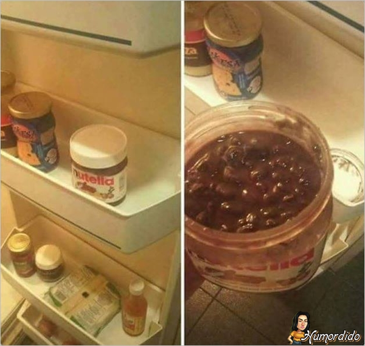

class: center, midle

# O que vamos fazer?

Algumas definições

Ver as funções básicas 

Falar de expressões regulares

---
# Básico de strings

Use **'** ou **"** para delimitar strings. Aspas duplas são preferiveis.

```{r}
s1 <- "Hello, World"
s1
s2 <- 'Eu não gosto de aspas simples, mas vou usar para mostrar que dá no mesmo'
s2
s3 <- c("mulher", "linda", "poderosa")
s3
```
---
# Alguns caracteres especiais

Para incluir caracteres especiais em uma string, você tem que que sinaliza-los com uma barra invertida:

<table>
        <tbody>
        <tr>
            <th>Símbolo</th>
            <th>Significado</th>
        </tr>
        <tr>
            <td>\n</td>
            <td>parágrafo</td>
        </tr>
        <tr>
            <td>\t</td>
            <td>tab</td>
        </tr>
        <tr>
        <td>\"</td>
        <td>aspas</td>
        </tr>
        <tr>
            <td>\'</td>
            <td>apóstrofe</td>
        </tr>
    </tbody>
    </table>

Use `?"'"` para listar todos
---
# O pacote stringr do R

No R base, temos várias funções para trabalhar com strings

As vantagens do `stringr` são:

<ul>
<li>possibiliade de trabalhar em várias línguas
<li>não considera NA como caracter
<li>possibilidade de trabalhar com expressões regulares
<\ul>

```{r}
library(stringr)
```
---

# A função `str_lenght`

```{r}
s3
str_length(s3)
```

# Combinando strings

```{r}
str_c("Eu", "adoro", "chocolate")
str_c("Eu", "adoro", "chocolate", sep = " ")
```
---
# Combinando vetores e strings

```{r}
s3
str_c(s3, collapse = ",")
str_c(1:3, s3)
str_c(str_c(1:3, ". "), s3)
```
---
# Separando strings

```{r}
s3
str_sub(s3, start = 1, end = 2)
str_sub(s3, -3, -2)
```
---
# Caixa alta e caixa baixa

```{r}
str_to_lower(s1)
str_to_upper(s1)
str_to_title(s1)
```
---
# Expressões Regulares
```{r}
s3
str_detect(s3, "l")
str_detect(s3, "a")
```
---
# Nem tudo é o que parece...

 
---
#Nem tudo é o que parece...

Sempre que um \ aparecer em uma expressão regular, você deve escrevê-lo como \\ na string que representa a expressão regular]

--

Use `writeLines()` para ver como R vê sua string após todos os caracteres especiais terem sido analisados
```{r}
writeLines("\\.")
writeLines("\\ é uma barra invertida")
```
---


